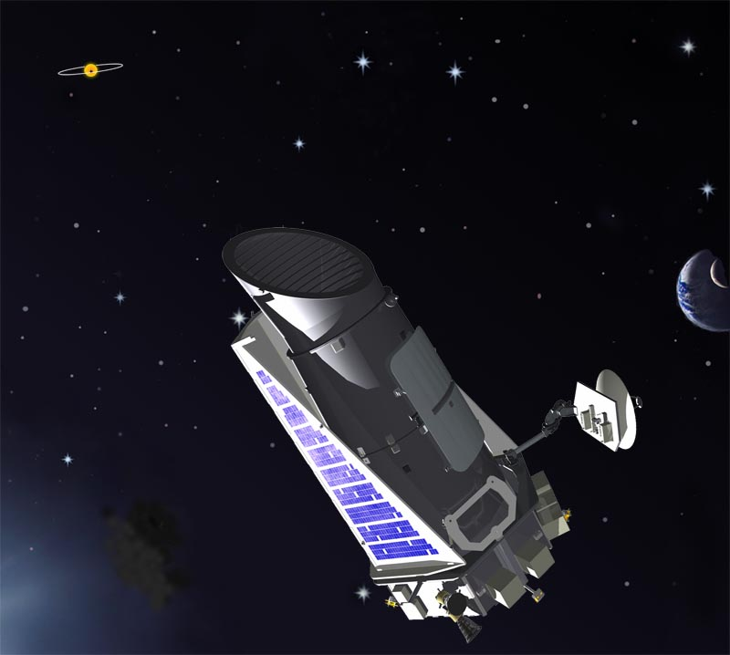

# StarTrace: Derin Öğrenme Metodları ile Exoplanet Tespiti Projesi


Kepler Uzay Teleskobu (2009-2018)

## Proje Tanımı

StarTrace, NASA Exoplanet Archive'dan alınan verileri kullanarak ötegezegen geçişlerini (transit) tespit etmeyi amaçlayan bir ikili sınıflandırma projesidir. Proje, derin öğrenme yöntemlerini kullanarak ışık eğrisi verilerindeki geçiş sinyallerini analiz ederek ötegezegen varlığını tahmin etmeyi hedefler. 

## Veri Seti

*   **Kaynak:** NASA Exoplanet Archive ([https://exoplanetarchive.ipac.caltech.edu/](https://exoplanetarchive.ipac.caltech.edu/)) adresinde bulunan Kepler KOI tablosu.
*   **Veri Tipi:** Işık eğrisi verileri (Zaman serisi)
*   **Özellikler:** Proje, ham ışık eğrisi verilerinden çıkarılan çeşitli özellikleri kullanabilir. Bu özellikler şunları içerebilir:
    *   Akı (Flux) değerleri
    *   Zaman (Time) değerleri
    *   Geçiş derinliği (Transit depth)
    *   Geçiş süresi (Transit duration)
    *   Diğer istatistiksel özellikler

## Kullanılan Teknolojiler

*   Proje **Python** ile geliştirilmiştir. 
*   Derin öğrenme metodları **sci-kit learn** kütüphanesi üzerinde gerçekleştirilmiştir.
*   Veri manipülasyonu ve görselleştirme işlemleri **pandas, numpy, matplotlib ve seaborn** kütüphaneleri kullanılarak gerçekleştirilmiştir.

## Proje Yapısı

    StarTrace/
    ├── data/ # Veri setinin bulunduğu dizin
    ├── notebooks/ # Jupyter Notebook dosyalarının bulunduğu dizin
    ├── src/ # Kaynak kod dosyalarının bulunduğu dizin
    │ ├── data_processing.py # Veri ön işleme fonksiyonları
    │ ├── model_training.py # model eğitme fonksiyonları
    │ ├── evaluation.py # Model performansını değerlendirme fonksiyonları
    │ └── utils.py # Yardımcı fonksiyonlar
    ├── models/ # Eğitilmiş modellerin kaydedildiği dizin
    ├── reports/ # Model performans raporlarının kaydedildiği dizin
    ├── README.md # Proje açıklaması (bu dosya)
    └── requirements.txt # Gerekli Python paketlerinin listesi

## Kurulum

1.  **Repoyu klonlayın:**

    ```bash
    git clone https://github.com/[kullanıcı_adınız]/StarTrace.git
    cd StarTrace
    ```

2.  **Sanal ortam oluşturun (önerilir):**

    ```bash
    python3 -m venv venv
    source venv/bin/activate  # Linux/macOS
    .\venv\Scripts\activate  # Windows
    ```

3.  **Gerekli paketleri yükleyin:**

    ```bash
    pip install -r requirements.txt
    ```

## Kullanım

1.  **Veri setini `data/` dizinine indirin ve yerleştirin.**  Veri setini NASA Exoplanet Archive'dan uygun formatta (örneğin, CSV) indirdiğinizden emin olun.

2.  **Jupyter Notebook'ları kullanarak veri analizi ve modelleme adımlarını takip edin:**

    ```bash
    jupyter notebook notebooks/Veri_Analizi_ve_Model_Gelistirme.ipynb
    ```

    (veya ilgili notebook adını kullanın).

3.  **Alternatif olarak, komut satırından da çalıştırabilirsiniz:**

    ```bash
    python src/data_processing.py  # Veriyi ön işleyin
    python src/model_training.py  # Modeli eğitin
    python src/evaluation.py    # Modeli değerlendirin
    ```

## İletişim

Sorularınız veya önerileriniz için **nil.uzunoglu@std.yildiz.edu.tr** adresinden benimle iletişime geçebilirsiniz.

